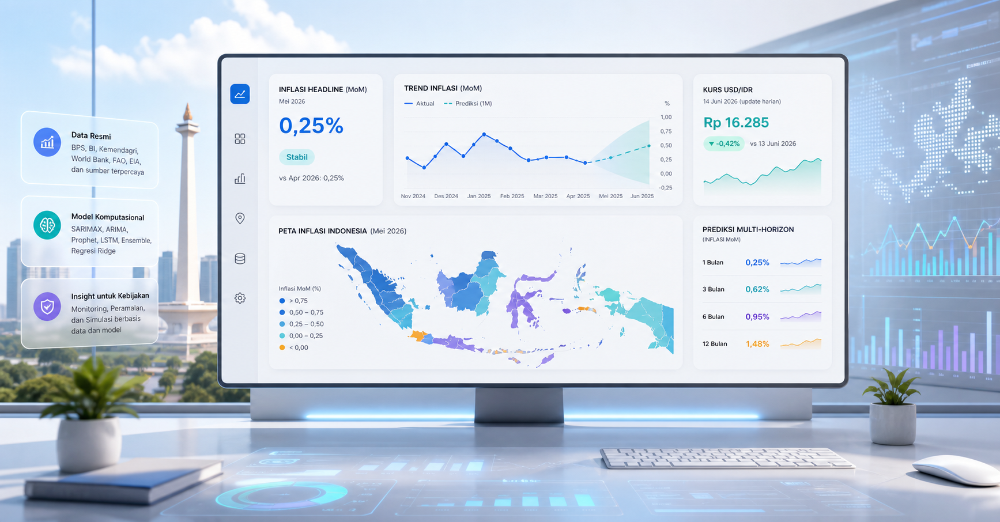

<div align="center">

# EcoDash

**Dashboard analitik ekonomi Indonesia untuk membaca inflasi, kurs, dan proksi daya beli secara lebih terstruktur, presentable, dan berbasis data resmi.**

<p>
  
</p>

<p>
  
  
  
  
</p>
<p>
  
  
  
  
</p>

</div>

> **Positioning**  
> EcoDash dirancang sebagai economic intelligence dashboard untuk demonstrasi profesional, eksplorasi akademik, dan pembacaan insight kebijakan berbasis data resmi Indonesia.

## Overview

EcoDash mengintegrasikan dua modul inti:

1. **Forecast inflasi multi-horizon** untuk membaca arah tekanan harga dalam horizon `1 bulan`, `3 bulan`, `6 bulan`, dan `12 bulan`.
2. **Estimasi pengeluaran riil per kapita per bulan sebagai proksi daya beli** untuk membaca arah tekanan terhadap kapasitas belanja rumah tangga secara regional.

Selain itu, dashboard juga menampilkan:

- ringkasan KPI ekonomi
- panel kurs USD/IDR harian
- peta ekonomi Indonesia berbasis indikator terpilih
- halaman panduan pembacaan dan panduan teknis

## Mengapa Proyek Ini Penting

Dalam praktiknya, angka ekonomi sering tersedia dalam banyak sumber, format, dan horizon waktu yang berbeda. EcoDash menyatukan alur tersebut ke dalam satu antarmuka yang lebih mudah dibaca untuk:

- **monitoring cepat**, ketika pengguna perlu melihat arah inflasi dan kurs terbaru
- **analisis komparatif**, ketika pengguna ingin membaca perbedaan wilayah atau horizon prediksi
- **komunikasi presentasi**, ketika insight perlu dijelaskan secara profesional kepada dosen, tim, atau pemangku kepentingan

## Modul Utama

### 1. Forecast Inflasi Multi-Horizon

Modul forecasting dibangun untuk empat horizon publik:

| Horizon | Fungsi Utama | Karakter Pembacaan |
| --- | --- | --- |
| `1M` | pembacaan taktis jangka dekat | paling relevan untuk headline near-term |
| `3M` | pembacaan arah kuartalan | cocok untuk evaluasi pergeseran tren |
| `6M` | pembacaan kebijakan menengah | membantu melihat arah tekanan yang lebih stabil |
| `12M` | orientasi makro | untuk konteks strategis, bukan angka presisi |

Setiap horizon dievaluasi secara **terpisah**. Dengan demikian, model terbaik untuk horizon `1M` tidak otomatis diasumsikan terbaik untuk `12M`.

#### Keluarga model yang dievaluasi

- `Naive Baseline`
- `ARIMA`
- `SARIMAX`
- `Prophet`
- `LSTM`
- `Bi-LSTM`
- `Ensemble` horizon-specific
- `GARCH` sebagai kandidat opsional jika asumsi statistik dan dependensi mendukung

#### Aturan seleksi model

- **MAE** digunakan sebagai metrik utama pemeringkatan
- **RMSE** dan **sMAPE** dicatat sebagai metrik pendamping
- UI publik hanya menampilkan **2 model terbaik** per horizon agar pembacaan tetap fokus

#### Confidence interval

Confidence interval dibangun dari **residual walk-forward backtest**, bukan dari shading dekoratif. Artinya:

- band prediksi merepresentasikan ketidakpastian historis model
- horizon yang lebih jauh memang akan menghasilkan band yang lebih lebar
- rentang prediksi harus dibaca sebagai **estimasi**, bukan kepastian

### 2. Proksi Daya Beli

Modul kedua tidak mengklaim mengukur daya beli murni secara teoritis. Target yang diprediksi adalah:

**pengeluaran riil per kapita per bulan**

Nilai tersebut kemudian diinterpretasikan sebagai **proksi daya beli**, karena merepresentasikan ruang belanja riil rumah tangga setelah penyesuaian inflasi.

Karakteristik implementasi saat ini:

- model utama menggunakan **Ridge Regression**
- inferensi simulasi memakai baseline wilayah terbaru dari data terproses
- fitur input aktif dapat dioverride pada skenario simulasi
- hasil diposisikan untuk membaca **arah perubahan**, bukan untuk klaim presisi absolut tinggi

## Workflow Sistem

```text
Data resmi
  -> preprocessing & harmonisasi
  -> feature engineering
  -> training / evaluasi model
  -> artefak model & JSON hasil
  -> Django dashboard & API layer
  -> visual insight untuk pengguna
```

## Arsitektur Ringkas

| Layer | Peran |
| --- | --- |
| `datasets/processed` | sumber data terproses untuk modeling |
| `dashboard/train_inflation_multihorizon.py` | training dan evaluasi forecast inflasi multi-horizon |
| `dashboard/train_daya_beli_ridge.py` | training model Ridge untuk proksi daya beli |
| `models/` | artefak model dan hasil forecast |
| `dashboard/predictions/views.py` | API dan delivery layer ke frontend |
| `dashboard/predictions/templates/` | halaman dashboard dan modul visual |

## Sumber Data dan Model Inti

### Data

Repositori ini menggunakan kombinasi data resmi dan referensi ekonomi, termasuk:

- **BPS** untuk inflasi dan indikator sosial-ekonomi terkait
- **Bank Indonesia** untuk konteks moneter domestik
- **World Bank / FRED / sumber pasar publik** untuk variabel eksternal yang relevan
- **endpoint kurs harian** untuk USD/IDR pada panel live exchange rate

### Model inti

| Modul | Model Produksi / Kandidat |
| --- | --- |
| Forecast inflasi | ARIMA, SARIMAX, Prophet, LSTM, Bi-LSTM, Ensemble, Naive |
| Proksi daya beli | Ridge Regression |

## Tech Stack

### Framework dan aplikasi

- **Django** untuk web application dan API delivery
- **Python** sebagai inti data-processing dan modeling pipeline

### Key libraries

- **pandas / numpy** untuk manipulasi data
- **scikit-learn** untuk pipeline regresi dan evaluasi
- **statsmodels** untuk ARIMA / SARIMAX
- **Prophet** untuk alternative forecasting
- **PyTorch** untuk LSTM / Bi-LSTM
- **matplotlib / seaborn** untuk eksplorasi dan visualisasi pendukung

## Quick Start

### 1. Install dependencies

```bash
pip install -r requirements.txt
```

### 2. Jalankan aplikasi

```bash
python dashboard/manage.py runserver
```

### 3. Jalankan test utama

```bash
python dashboard/manage.py test predictions.tests
```

## Retrain Pipeline

### Retrain proksi daya beli

```bash
python dashboard/train_daya_beli_ridge.py
```

### Retrain forecast inflasi multi-horizon

```bash
python dashboard/train_inflation_multihorizon.py
```

Script forecasting akan memperbarui artefak yang dipakai web, termasuk:

- ranking model per horizon
- dua model terbaik per horizon
- point forecast
- confidence interval
- payload JSON untuk dashboard

## Struktur Repo

```text
.
|-- dashboard/
|   |-- manage.py
|   |-- predictions/
|   |   |-- templates/predictions/
|   |   |-- static/predictions/
|   |   `-- views.py
|   |-- train_inflation_multihorizon.py
|   `-- train_daya_beli_ridge.py
|-- datasets/
|   `-- processed/
|       |-- clean_inflasi_ts.csv
|       `-- clean_daya_beli.csv
|-- docs/
|   `-- readme/
|       `-- hero-ecodash.png
|-- models/
|   |-- inflation_multihorizon_forecast.json
|   |-- inflation_multihorizon_comparison.json
|   |-- forecast_results.json
|   `-- best_daya_beli_ridge.pkl
`-- README.md
```

## Evaluasi dan Catatan Interpretasi

- Forecast horizon pendek lebih cocok untuk pembacaan operasional jangka dekat.
- Forecast horizon panjang tetap berguna, tetapi harus dibaca bersama confidence interval.
- Nilai `R^2` pada model proksi daya beli adalah **goodness-of-fit**, bukan akurasi klasifikasi.
- Modul proksi daya beli saat ini lebih kuat untuk membaca **arah tekanan** dan **perubahan relatif**, dibanding klaim angka absolut yang sangat presisi.

## Antarmuka Utama

| Halaman | Fungsi |
| --- | --- |
| `Home (/)` | landing page dan headline publik |
| `Dashboard (/dashboard/)` | pusat monitoring operasional |
| `Forecasting (/forecasting/)` | analisis forecast multi-horizon |
| `Daya Beli (/daya-beli/)` | simulasi proksi daya beli berbasis model |
| `Panduan (/panduan/)` | panduan pembacaan dan panduan teknis |
| `Map (/map/)` | peta ekonomi Indonesia dengan filter indikator dan tahun |

## Use Cases

- presentasi akademik dan demonstrasi proyek
- eksplorasi insight inflasi lintas horizon
- pembacaan pergeseran tekanan ekonomi regional
- komunikasi visual hasil modeling kepada audiens profesional

## Tim

| Nama | Peran |
| --- | --- |
| Muhammad Rajif Al Farikhi | Backend |
| Sahrul Adicandra Effendy | Backend + Data |
| Semaya David Petroes Putra | Modelling |
| Adrina Firda Marwah | Modelling |
| Okan Athallah Maredith | Frontend |

---

<div align="center">
  <sub>EcoDash dikembangkan sebagai dashboard analitik ekonomi yang memadukan disiplin data, forecasting, dan presentasi visual yang siap ditunjukkan secara profesional.</sub>
</div>
